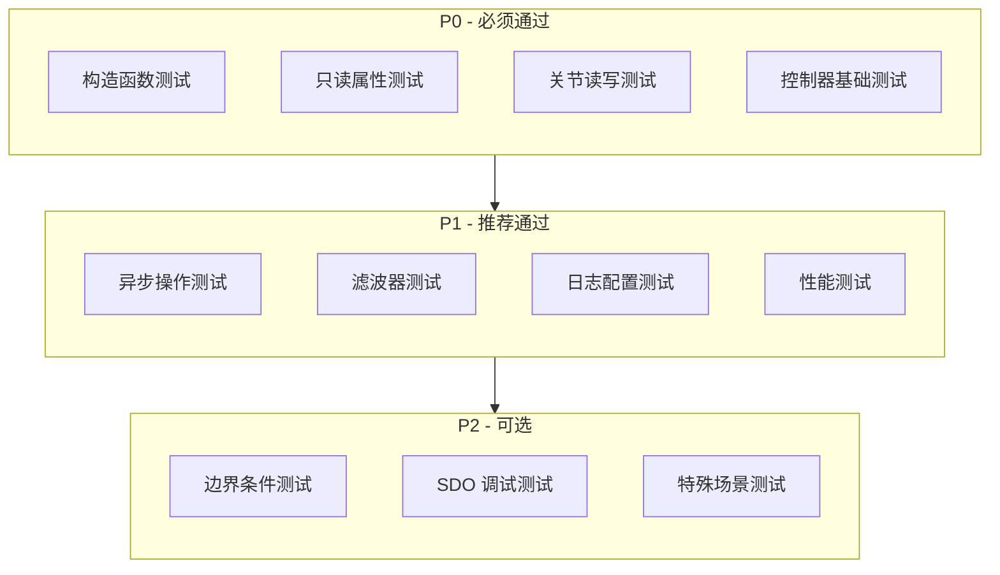
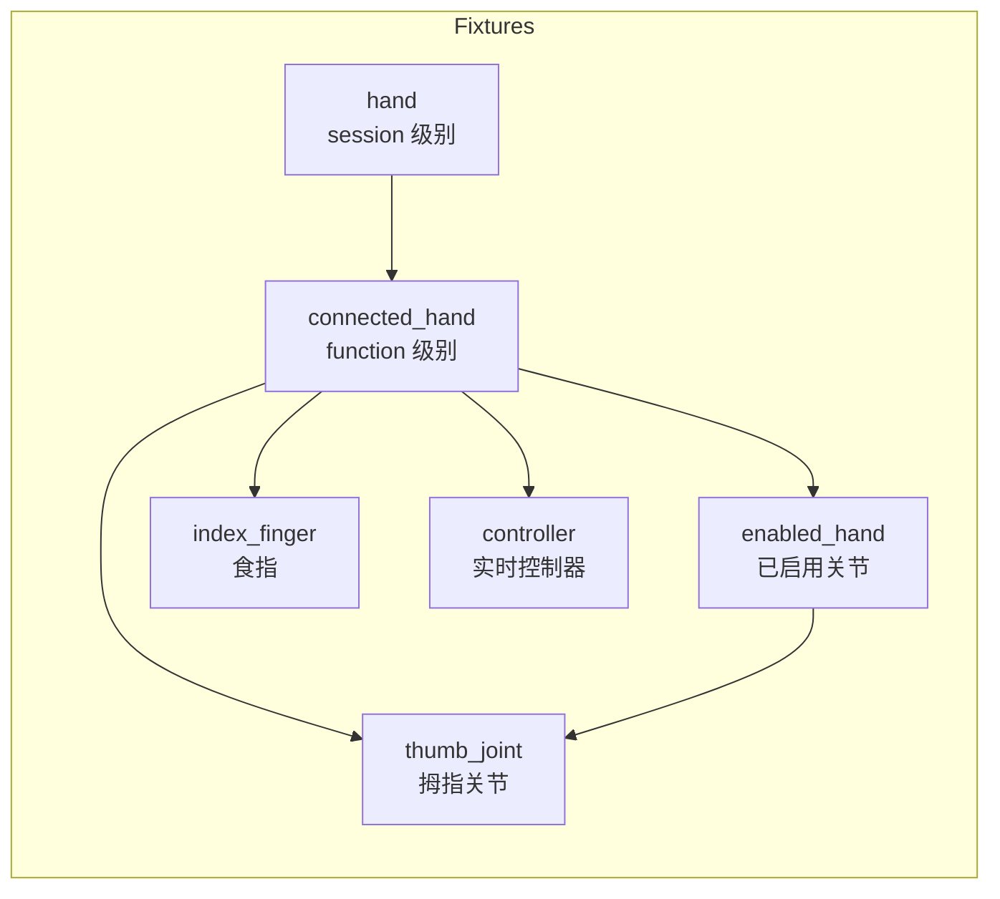
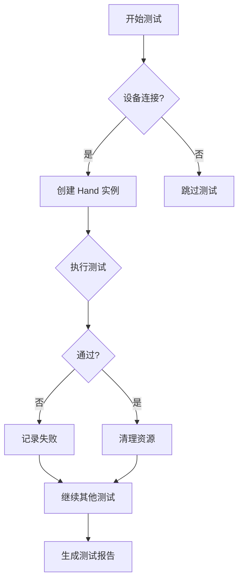
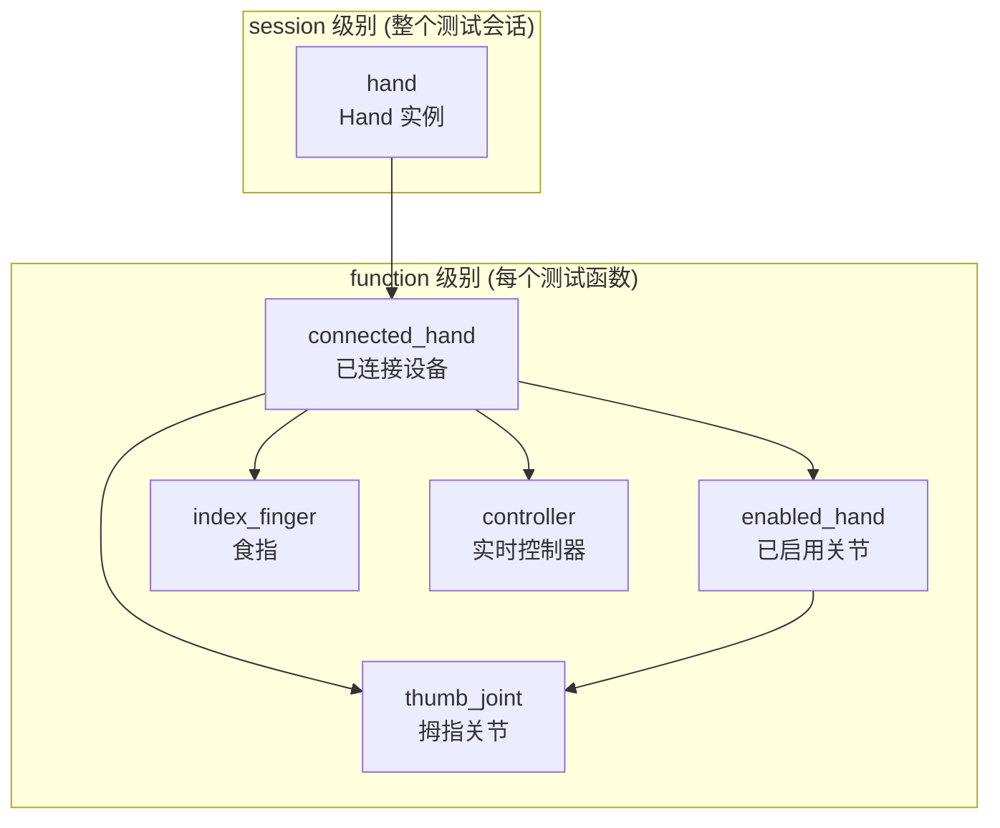
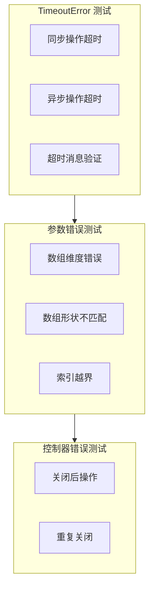
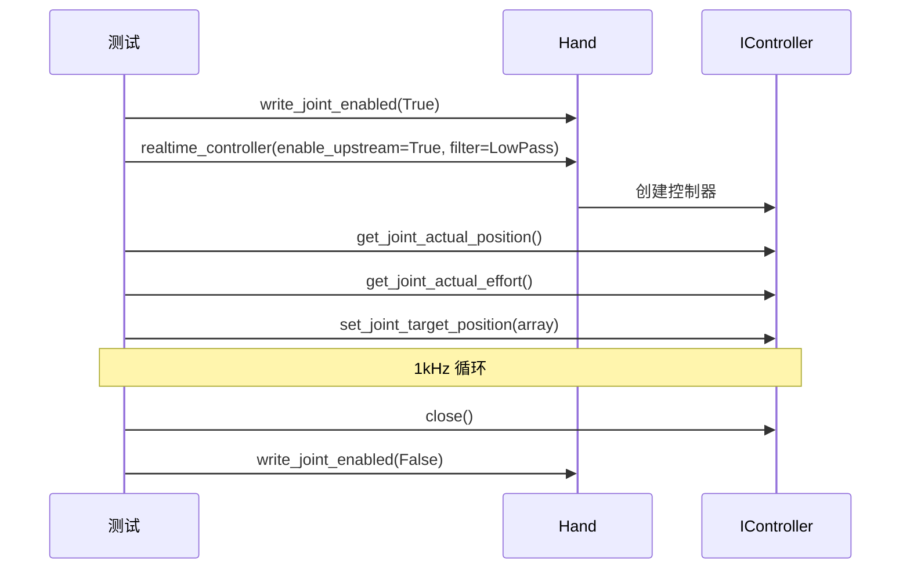

# WujihandPy 测试框架结构

## 目录结构

```
tests/
├── __init__.py                  # 测试包初始化
├── conftest.py                  # pytest 共享配置和 fixture
├── pytest.ini                   # pytest 配置
├── test_hand.py                 # Hand 类测试
│   ├── TestHandConstructor
│   ├── TestHandReadOnlyProperties
│   ├── TestHandJointReadProperties
│   ├── TestHandJointWriteProperties
│   └── TestHandSpecialMethods
├── test_finger.py               # Finger 类测试
│   ├── TestFingerMethods
│   ├── TestFingerJointReadProperties
│   ├── TestFingerJointWriteProperties
│   └── TestFingerAllFingers
├── test_joint.py                # Joint 类测试
│   ├── TestJointReadProperties
│   ├── TestJointWriteProperties
│   ├── TestJointPosition
│   └── TestJointAllJoints
├── test_controller.py           # IController 测试
│   ├── TestIControllerBasic
│   ├── TestIControllerNoUpstream
│   ├── TestIControllerRealTimeControl
│   ├── TestIControllerWithFilter
│   └── TestIControllerPositionRange
├── test_filter.py               # filter 模块测试
│   ├── TestLowPassFilter
│   ├── TestFilterInterface
│   └── TestFilterWithHand
├── test_logging.py              # logging 模块测试
│   ├── TestLoggingLevel
│   ├── TestLoggingConsole
│   ├── TestLoggingFile
│   ├── TestLoggingLevel
│   ├── TestLoggingFlush
│   └── TestLoggingIntegration
└── test_exceptions.py           # 异常处理测试
    ├── TestTimeoutError
    ├── TestParameterErrors
    ├── TestControllerClosedError
    ├── TestInvalidMaskError
    └── TestExceptionHandling
```

## 测试优先级分类



## Fixture 依赖关系



## 测试用例统计

| 模块 | P0 | P1 | P2 | 总计 |
|------|----|----|----|------|
| Hand | 7 | 11 | 7 | 25 |
| Finger | 4 | 5 | 3 | 12 |
| Joint | 5 | 6 | 1 | 12 |
| IController | 5 | 5 | 2 | 12 |
| filter | 2 | 0 | 3 | 5 |
| logging | 0 | 7 | 1 | 8 |
| exceptions | 1 | 3 | 3 | 7 |
| **总计** | **24** | **37** | **20** | **81** |

## 测试流程



## Fixture 作用域



## 运行命令

```bash
# 运行所有测试
pytest tests/ -v

# 按优先级运行
pytest tests/ -k "P0" -v    # P0 测试
pytest tests/ -k "P1" -v    # P1 测试
pytest tests/ -k "P2" -v    # P2 测试

# 运行特定模块
pytest tests/test_hand.py -v
pytest tests/test_controller.py -v

# 生成 JUnit XML 报告
pytest tests/ --junitxml=report.xml

# 生成覆盖率报告
pytest tests/ --cov=wujihandpy --cov-report=html
```

## 测试标记 (Markers)

```python
@pytest.mark.P0  # 必须通过 - 基础功能
@pytest.mark.P1  # 推荐通过 - 完整功能
@pytest.mark.P2  # 可选 - 边界条件
```

## conftest.py 核心配置

```python
# Fixture 作用域
@pytest.fixture(scope="session")    # 整个会话共享
@pytest.fixture(scope="function")   # 每个函数独立

# 共享 Fixture
hand                    # Hand 实例 (session)
connected_hand          # 已连接设备 (function)
enabled_hand            # 已启用关节 (function)
thumb_joint             # 拇指关节 (function)
index_finger            # 食指 (function)
valid_position_array    # 有效位置数组 (5,4)
valid_single_value      # 有效单值 (float)
```

## 异常测试覆盖



## 实时控制器测试


