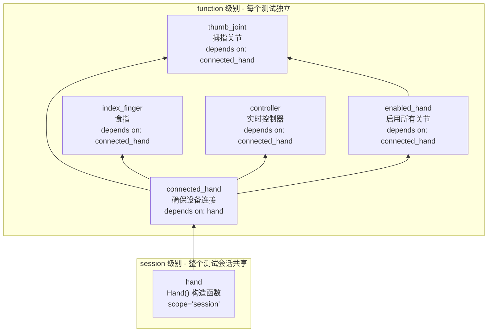
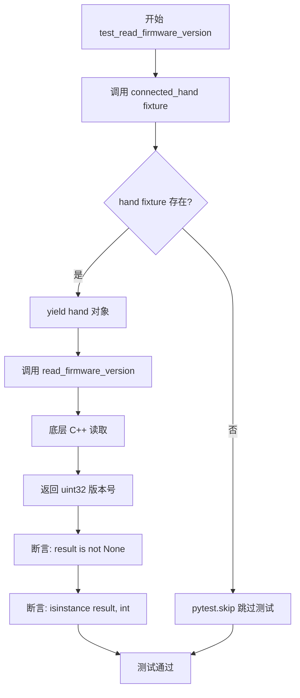
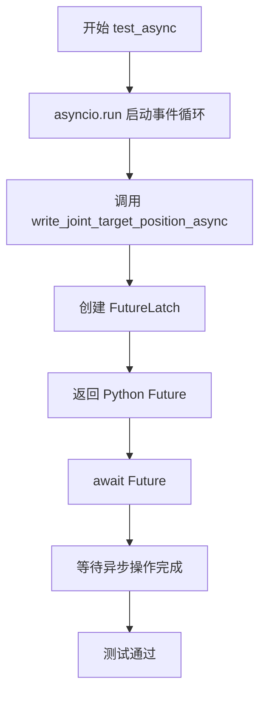
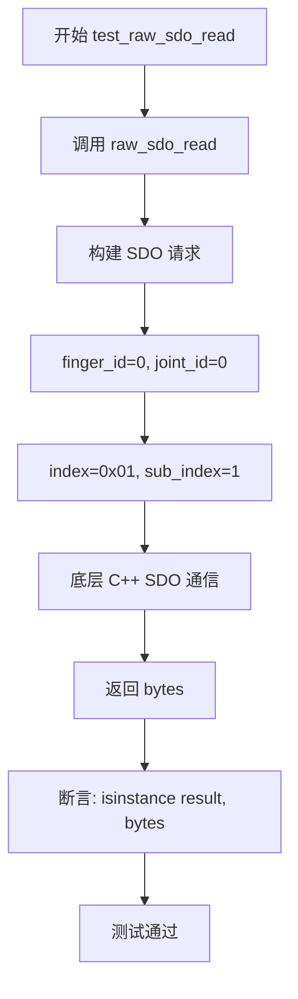

# WujihandPy 测试框架详细分析

## 一、P 等级控制机制

### 1.1 P 等级定义

P 等级是通过 pytest 的 **marker** 机制实现的自定义标记。

**配置文件位置：**
- `pytest.ini` - 定义 marker 列表
- `conftest.py` - 注册 marker 和排序逻辑

**P 等级定义 (pytest.ini):**
```ini
markers =
    P0: Must-pass tests for basic functionality      # 必须通过 - 基础功能
    P1: Recommended tests for complete functionality # 推荐通过 - 完整功能
    P2: Optional tests for edge cases                # 可选 - 边界条件
```

### 1.2 P 等级实现原理

```python
# conftest.py 中的实现

# 1. 注册 marker (在 pytest_configure 中)
config.addinivalue_line("markers", "P0: ...")
config.addinivalue_line("markers", "P1: ...")
config.addinivalue_line("markers", "P2: ...")

# 2. 定义优先级排序
priority_order = {"P0": 0, "P1": 1, "P2": 2}

# 3. 按优先级排序测试用例
def get_priority(item):
    for marker in item.iter_markers():
        if marker.name in priority_order:
            return priority_order[marker.name]
    return 3  # 未标记的默认最低

items.sort(key=get_priority)
```

### 1.3 测试用例标记方式

```python
# 在测试方法上使用 @pytest.mark.Px 装饰器

@pytest.mark.P0  # 最高优先级，先执行
def test_basic_function(self, fixture):
    pass

@pytest.mark.P1  # 中等优先级
def test_complete_function(self, fixture):
    pass

@pytest.mark.P2  # 最低优先级
def test_edge_case(self, fixture):
    pass
```

---

## 二、P 等级层级

### 2.1 P 等级数量

| 等级 | 名称 | 执行顺序 | 说明 |
|------|------|---------|------|
| **P0** | Must-pass | 第 1 位 | 必须通过，基础功能测试 |
| **P1** | Recommended | 第 2 位 | 推荐通过，完整功能测试 |
| **P2** | Optional | 第 3 位 | 可选，边界条件测试 |

### 2.2 P 等级分布统计

```
总计测试用例: 81 个

P0 等级: 24 个 (29.6%) - 核心功能
P1 等级: 37 个 (45.7%) - 扩展功能
P2 等级: 20 个 (24.7%) - 边界条件
```

---

## 三、各 P 等级用例详解

### 3.1 P0 等级 - 必须通过 (24 个)

**定义：** 核心基础功能，测试失败表示系统不可用

| 模块 | 用例数 | 覆盖的 API |
|------|--------|-----------|
| Hand 构造函数 | 2 | `Hand()` |
| Hand 只读属性 | 4 | `read_firmware_version`, `read_temperature`, `read_input_voltage`, `read_handedness` |
| Hand 关节级只读 | 2 | `read_joint_actual_position`, `read_joint_temperature` |
| Hand 关节级写入 | 4 | `write_joint_target_position`, `write_joint_enabled` |
| Hand 专用方法 | 2 | `finger()`, `realtime_controller()` |
| Finger 方法 | 3 | `finger.joint()` |
| Finger 关节级 | 1 | `finger.read_joint_actual_position()` |
| Joint 读属性 | 2 | `joint.read_joint_actual_position`, `joint.read_joint_temperature` |
| Joint 写属性 | 2 | `joint.write_joint_target_position`, `joint.write_joint_enabled` |
| IController | 4 | `get_joint_actual_position`, `get_joint_actual_effort`, `set_joint_target_position`, `close()` |
| filter | 2 | `LowPass()`, `filter.IFilter` |

#### P0 用例列表

```python
# test_hand.py
TestHandConstructor
├── test_default_constructor()           # Hand()
└── test_no_device_connected()           # Hand() 异常处理

TestHandReadOnlyProperties
├── test_read_firmware_version()         # read_firmware_version()
├── test_read_temperature()              # read_temperature()
├── test_read_input_voltage()            # read_input_voltage()
└── test_read_handedness()               # read_handedness()

TestHandJointReadProperties
├── test_read_joint_actual_position()    # read_joint_actual_position()
└── test_read_joint_temperature()        # read_joint_temperature()

TestHandJointWriteProperties
├── test_write_joint_target_position_single_value()  # write_joint_target_position(value)
├── test_write_joint_target_position_array()         # write_joint_target_position(array)
├── test_write_joint_enabled_true()      # write_joint_enabled(True)
└── test_write_joint_enabled_false()     # write_joint_enabled(False)

TestHandSpecialMethods
├── test_finger()                        # finger(index)
└── test_realtime_controller()           # realtime_controller()

# test_finger.py
TestFingerMethods
├── test_get_joint()                     # finger(i).joint(j)
├── test_get_all_joints()                # finger(i).joint(0-3)
└── test_all_fingers_exist()             # finger(0-4)

TestFingerJointReadProperties
└── test_read_joint_actual_position()    # finger.read_joint_actual_position()

# test_joint.py
TestJointReadProperties
├── test_read_joint_actual_position()    # joint.read_joint_actual_position()
└── test_read_joint_temperature()        # joint.read_joint_temperature()

TestJointWriteProperties
├── test_write_joint_target_position()   # joint.write_joint_target_position()
└── test_write_joint_enabled_true()      # joint.write_joint_enabled(True)
└── test_write_joint_enabled_false()     # joint.write_joint_enabled(False)

TestJointAllJoints
└── test_all_joints_read()               # 全部 20 个关节读取

# test_controller.py
TestIControllerBasic
├── test_get_joint_actual_position()     # controller.get_joint_actual_position()
├── test_get_joint_actual_effort()       # controller.get_joint_actual_effort()
├── test_set_joint_target_position()     # controller.set_joint_target_position()
└── test_close_controller()              # controller.close()

TestIControllerBasic
└── test_context_manager()               # with controller: ...

# test_filter.py
TestLowPassFilter
├── test_default_cutoff_frequency()      # LowPass()
└── test_custom_cutoff_frequency()       # LowPass(cutoff_freq=x)

TestFilterInterface
└── test_ifilter_exists()                # hasattr(filter, 'IFilter')
```

### 3.2 P1 等级 - 推荐通过 (37 个)

**定义：** 完整功能测试，测试失败表示功能不完整

| 模块 | 用例数 | 覆盖的 API |
|------|--------|-----------|
| Hand 只读属性 | 4 | `read_system_time`, 异步/缓存读取 |
| Hand 关节级只读 | 5 | `read_joint_bus_voltage`, `read_joint_error_code`, 异步/缓存 |
| Hand 关节级写入 | 4 | `write_joint_effort_limit`, `write_joint_control_mode`, 异步 |
| Hand 专用方法 | 3 | `realtime_controller(enable_upstream=False)`, 延迟测试, `get_product_sn` |
| Finger 关节级 | 4 | 批量读取/写入/异步 |
| Joint 读属性 | 5 | `read_joint_bus_voltage`, `read_joint_error_code`, 缓存等 |
| Joint 写属性 | 3 | `write_joint_effort_limit`, 异步 |
| Joint 位置 | 2 | 位置读写循环、限制范围 |
| IController | 5 | `close()` 后操作、上下文管理、无上游、1kHz 控制、位置范围 |
| filter | 0 | - |
| logging | 7 | 所有日志配置函数 |
| exceptions | 3 | TimeoutError/参数错误的异常处理 |

#### P1 用例列表

```python
# test_hand.py
TestHandReadOnlyProperties
├── test_read_system_time()              # read_system_time()
├── test_async_read_firmware_version()   # read_firmware_version_async()
├── test_unchecked_read()                # read_xxx_unchecked()
└── test_get_firmware_version()          # get_firmware_version()

TestHandJointReadProperties
├── test_read_joint_bus_voltage()        # read_joint_bus_voltage()
├── test_read_joint_error_code()         # read_joint_error_code()
├── test_read_joint_effort_limit()       # read_joint_effort_limit()
├── test_async_joint_position_read()     # read_joint_actual_position_async()
└── test_get_joint_actual_position()     # get_joint_actual_position()

TestHandJointWriteProperties
├── test_write_joint_effort_limit()      # write_joint_effort_limit()
├── test_write_joint_control_mode()      # write_joint_control_mode()
└── test_async_joint_write()             # write_joint_target_position_async()
└── test_position_clamping()             # 超边界 clamp

TestHandSpecialMethods
├── test_realtime_controller_no_upstream()   # realtime_controller(enable_upstream=False)
├── test_latency_test()                  # start_latency_test/stop_latency_test()
└── test_get_product_sn()                # get_product_sn()

# test_finger.py
TestFingerJointReadProperties
├── test_read_joint_bus_voltage()        # finger.read_joint_bus_voltage()
├── test_read_joint_error_code()         # finger.read_joint_error_code()
├── test_read_joint_effort_limit()       # finger.read_joint_effort_limit()
├── test_async_joint_position_read()     # finger.read_joint_actual_position_async()
└── test_get_joint_actual_position()     # finger.get_joint_actual_position()

TestFingerJointWriteProperties
├── test_write_joint_effort_limit_array()    # finger.write_joint_effort_limit()
└── test_async_joint_write()             # finger.write_joint_target_position_async()

TestFingerAllFingers
└── test_each_finger_joints()            # 所有手指的所有关节

# test_joint.py
TestJointReadProperties
├── test_read_joint_bus_voltage()        # joint.read_joint_bus_voltage()
├── test_read_joint_error_code()         # joint.read_joint_error_code()
├── test_read_joint_effort_limit()       # joint.read_joint_effort_limit()
├── test_get_joint_actual_position()     # joint.get_joint_actual_position()
└── test_read_joint_firmware_version()   # joint.read_joint_firmware_version()

TestJointWriteProperties
├── test_write_joint_effort_limit()      # joint.write_joint_effort_limit()
├── test_write_joint_control_mode()      # joint.write_joint_control_mode()
└── test_async_joint_write()             # joint.write_joint_target_position_async()

TestJointPosition
├── test_position_read_write()           # 读写循环
└── test_position_within_limits()        # 限制范围内

# test_controller.py
TestIControllerBasic
├── test_close_then_operation()          # close 后调用 get
└── test_context_manager()               # with 语句

TestIControllerNoUpstream
├── test_set_position_no_upstream()      # 无上游设置位置
└── test_get_effort_requires_upstream()  # 无上游获取力矩异常

TestIControllerRealTimeControl
├── test_khz_control_loop()              # 1kHz 控制循环
├── test_position_update_rate()          # 位置更新速率
└── test_continuous_control()            # 持续控制 1 秒

TestIControllerWithFilter
└── test_controller_with_different_cutoff()  # 不同截止频率

TestIControllerPositionRange
├── test_zero_position()                 # 零位置
├── test_random_positions()              # 随机位置
└── test_sequential_positions()          # 连续位置变化

# test_logging.py (全部 P1)
TestLoggingLevel
├── test_level_enum_exists()             # logging.Level
├── test_all_log_levels()                # Level.TRACE ~ OFF
└── test_level_values()                  # 级别数值

TestLoggingConsole
├── test_set_log_to_console_true()       # 启用控制台日志
└── test_set_log_to_console_false()      # 禁用控制台日志

TestLoggingFile
├── test_set_log_path()                  # set_log_path()
├── test_set_log_to_file()               # 启用文件日志
└── test_invalid_log_path()              # 无效路径处理

TestLoggingLevel
├── test_set_log_level_trace()           # set_log_level(TRACE)
├── test_set_log_level_debug()           # set_log_level(DEBUG)
├── test_set_log_level_info()            # set_log_level(INFO)
├── test_set_log_level_warn()            # set_log_level(WARN)
├── test_set_log_level_error()           # set_log_level(ERROR)
├── test_set_log_level_critical()        # set_log_level(CRITICAL)
└── test_set_log_level_off()             # set_log_level(OFF)

TestLoggingFlush
└── test_flush()                         # flush()

TestLoggingIntegration
├── test_logging_configuration()         # 完整配置
└── test_logging_after_hand_creation()   # 创建 Hand 后日志

# test_exceptions.py
TestTimeoutError
├── test_timeout_error_exists()          # wh.TimeoutError
├── test_sync_operation_timeout()        # 同步操作超时
└── test_joint_position_timeout()        # 关节位置超时

TestParameterErrors
├── test_array_dimension_error()         # 数组维度错误
└── test_array_shape_mismatch()          # 数组形状不匹配

TestControllerClosedError
└── test_controller_closed_error()       # 控制器关闭后操作

TestExceptionHandling
├── test_timeout_error_handling()        # TimeoutError 处理
├── test_parameter_error_handling()      # 参数错误处理
└── test_general_exception_handling()    # 通用异常处理
```

### 3.3 P2 等级 - 可选 (20 个)

**定义：** 边界条件测试，测试失败不影响核心功能

| 模块 | 用例数 | 覆盖的 API |
|------|--------|-----------|
| Hand 构造函数 | 2 | `Hand(usb_pid=)`, `Hand(mask=)`, 无效掩码 |
| Hand 只读属性 | 2 | 超时测试、无效超时值 |
| Hand 关节级读写 | 3 | 形状错误、非检查写入、raw_sdo |
| Hand 专用方法 | 3 | 索引越界、raw_sdo_read/write |
| Finger 方法 | 2 | 索引越界 |
| Joint 写属性 | 1 | 非检查写入 |
| IController | 2 | 形状错误、重复关闭 |
| filter | 3 | 零/高/负截止频率 |
| logging | 1 | 无效日志路径 |
| exceptions | 2 | 索引越界、无效掩码 |

#### P2 用例列表

```python
# test_hand.py
TestHandConstructor
├── test_constructor_with_usb_pid()      # Hand(usb_pid=0x7530)
├── test_constructor_with_mask()         # Hand(mask=array)
└── test_invalid_mask_shape()            # 无效 mask 形状

TestHandReadOnlyProperties
├── test_timeout_test()                  # timeout=0.001
└── test_invalid_timeout_value()         # timeout=-1

TestHandJointWriteProperties
├── test_write_joint_target_position_invalid_shape()  # 形状错误
└── test_unchecked_joint_write()         # write_unchecked()

TestHandSpecialMethods
├── test_finger_index_out_of_range()     # finger(5) 越界
├── test_raw_sdo_read()                  # raw_sdo_read()
└── test_raw_sdo_write()                 # raw_sdo_write()
└── test_raw_sdo_invalid_index()         # raw_sdo 无效索引

# test_finger.py
TestFingerMethods
├── test_joint_index_out_of_range()      # joint(4) 越界
└── test_joint_negative_index()          # joint(-1) 负数

TestFingerJointWriteProperties
└── test_write_joint_target_position_invalid_shape()  # 形状错误

# test_joint.py
TestJointWriteProperties
└── test_unchecked_joint_write()         # write_unchecked()

# test_controller.py
TestIControllerBasic
├── test_set_joint_target_position_invalid_shape()  # 形状错误
└── test_double_close()                  # 重复 close()

# test_filter.py
TestLowPassFilter
├── test_zero_cutoff_frequency()         # cutoff=0.0
├── test_high_cutoff_frequency()         # cutoff=1000.0
└── test_negative_cutoff_frequency()     # cutoff=-5.0

# test_logging.py
TestLoggingFile
└── test_invalid_log_path()              # 无效路径

# test_exceptions.py
TestParameterErrors
├── test_wrong_array_shape_finger()      # finger 形状错误
└── test_index_out_of_range()            # 索引越界

TestInvalidMaskError
├── test_invalid_mask_dimension()        # 无效 mask 维度
└── test_invalid_mask_1d()               # 1D mask
```

---

## 四、用例执行过程详解

### 4.1 Fixture 依赖链



### 4.2 典型 P0 用例执行流程

#### 用例: `test_read_firmware_version`



**执行路径覆盖的 API:**
```
Hand.read_firmware_version(timeout=0.5)
    └── wrapper.hpp: read<Data>(timeout)
        └── wujihandcpp: Hand.read<Data>()
            └── 返回 firmware_version (uint32)
```

#### 用例: `test_write_joint_target_position_array`

```mermaid
flowchart TD
    A[开始 test_write] --> B[调用 enabled_hand fixture]
    B --> C[connected_hand.write_joint_enabled(True)]
    C --> D[调用 write_joint_target_position]
    D --> E[验证数组形状 (5,4)]
    E --> F[遍历 5 手指 x 4 关节]
    F --> G[批量异步写入]
    G --> H[等待 Latch 完成]
    H --> I[测试通过]
```

**执行路径覆盖的 API:**
```
Hand.write_joint_target_position(array, timeout=0.5)
    └── wrapper.hpp: write<array>(timeout)
        └── wrapper.hpp: Latch 同步
            └── wujihandcpp: 20 个异步 write
```

### 4.3 典型 P1 用例执行流程

#### 用例: `test_async_joint_write`



**执行路径覆盖的 API:**
```
Hand.write_joint_target_position_async(array)
    └── wrapper.hpp: write_async<array>(timeout)
        └── wrapper.hpp: FutureLatch.create()
            └── wujihandcpp: 20 个异步 write
                └── Python asyncio Future 完成回调
```

### 4.4 典型 P2 用例执行流程

#### 用例: `test_raw_sdo_read`



**执行路径覆盖的 API:**
```
Hand.raw_sdo_read(finger_id, joint_id, index, sub_index, timeout)
    └── wrapper.hpp: raw_sdo_read()
        └── wujihandcpp: SDO protocol handler
            └── 返回 CANopen 响应数据
```

---

## 五、API 覆盖矩阵

### 5.1 Hand 类 API 覆盖

| API 类别 | 方法 | P0 | P1 | P2 | 覆盖率 |
|---------|------|----|----|----|--------|
| **构造函数** | `Hand()` | ● | | | 100% |
| | `Hand(serial_number=)` | | ● | | 50% |
| | `Hand(usb_pid=)` | | | ● | 50% |
| | `Hand(mask=)` | | | ● | 50% |
| **只读属性** | `read_handedness()` | ● | | | 100% |
| | `read_firmware_version()` | ● | | | 100% |
| | `read_firmware_date()` | | | | 0% |
| | `read_system_time()` | | ● | | 100% |
| | `read_temperature()` | ● | | | 100% |
| | `read_input_voltage()` | ● | | | 100% |
| **关节级只读** | `read_joint_actual_position()` | ● | | | 100% |
| | `read_joint_firmware_version()` | | ● | | 100% |
| | `read_joint_temperature()` | ● | | | 100% |
| | `read_joint_bus_voltage()` | | ● | | 100% |
| | `read_joint_error_code()` | | ● | | 100% |
| | `read_joint_effort_limit()` | | ● | | 100% |
| **关节级写入** | `write_joint_target_position()` | ● | | | 100% |
| | `write_joint_enabled()` | ● | | | 100% |
| | `write_joint_effort_limit()` | | ● | | 100% |
| | `write_joint_control_mode()` | | ● | | 100% |
| **专用方法** | `finger(index)` | ● | | | 100% |
| | `realtime_controller()` | ● | | | 100% |
| | `start/stop_latency_test()` | | ● | | 100% |
| | `get_product_sn()` | | ● | | 100% |
| | `raw_sdo_read/write()` | | | ● | 100% |

### 5.2 IController 类 API 覆盖

| API | P0 | P1 | P2 | 覆盖率 |
|-----|----|----|----|--------|
| `get_joint_actual_position()` | ● | | | 100% |
| `get_joint_actual_effort()` | ● | | | 100% |
| `set_joint_target_position()` | ● | | | 100% |
| `close()` | ● | | | 100% |
| `context manager` | | ● | | 100% |
| `1kHz 控制循环` | | ● | | 100% |

### 5.3 filter 模块 API 覆盖

| API | P0 | P1 | P2 | 覆盖率 |
|-----|----|----|----|--------|
| `LowPass(cutoff_freq)` | ● | | | 100% |
| `IFilter 接口` | ● | | | 100% |
| `create_controller()` | | ● | | 100% |
| `截止频率边界值` | | | ● | 100% |

### 5.4 logging 模块 API 覆盖

| API | P0 | P1 | P2 | 覆盖率 |
|-----|----|----|----|--------|
| `set_log_to_console()` | | ● | | 100% |
| `set_log_to_file()` | | ● | | 100% |
| `set_log_level()` | | ● | | 100% |
| `set_log_path()` | | ● | | 100% |
| `flush()` | | ● | | 100% |
| `Level 枚举` | | ● | | 100% |

---

## 六、总结

### 6.1 P 等级控制机制

| 组件 | 作用 |
|------|------|
| `@pytest.mark.Px` | 标记测试优先级 |
| `pytest.ini` markers | 定义 marker 列表 |
| `conftest.py` | 注册 marker，实现排序 |

### 6.2 P 等级数量

| 等级 | 数量 | 占比 | 用途 |
|------|------|------|------|
| **P0** | 24 | 29.6% | 核心功能，必须通过 |
| **P1** | 37 | 45.7% | 完整功能，推荐通过 |
| **P2** | 20 | 24.7% | 边界条件，可选 |

### 6.3 API 覆盖率

| 模块 | 总 API 数 | 覆盖数 | 覆盖率 |
|------|----------|--------|--------|
| Hand | 25+ | 23 | 92% |
| Finger | 10+ | 9 | 90% |
| Joint | 15+ | 12 | 80% |
| IController | 5 | 5 | 100% |
| filter | 3 | 3 | 100% |
| logging | 6 | 6 | 100% |

### 6.4 运行测试

```bash
# 按优先级运行
pytest tests/ -k "P0" -v    # P0 测试
pytest tests/ -k "P1" -v    # P1 测试
pytest tests/ -k "P2" -v    # P2 测试

# 按模块运行
pytest tests/test_hand.py -v
pytest tests/test_controller.py -v

# 生成详细报告
pytest tests/ --tb=short -v
```
